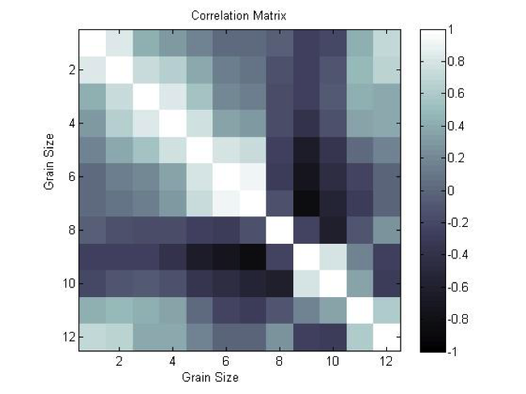
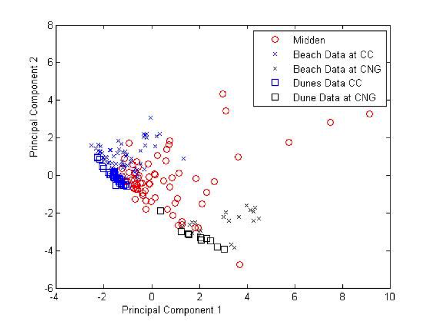
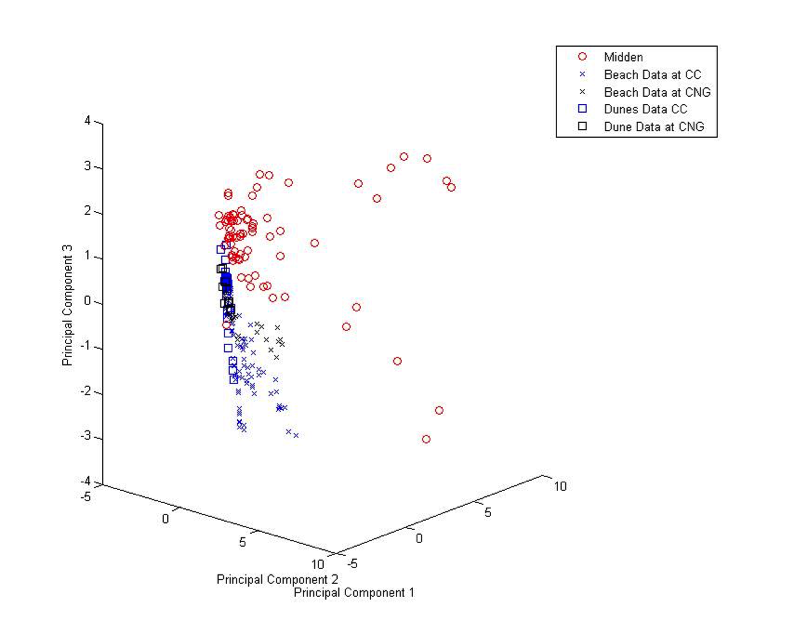

# Principal Component Analysis to Determine Midden Location With Respect to Paleo-Shorelines
This repository contains a MATLAB script that applies principal component analysis to sand grain size data to determine midden locations with respect to paleo-shorelines. The data set consists of particle size measurements originally presented in Timmins [1981] and analyzed by Olbricht [1982]. The data used in this study is not mine and not available in he repository. An explanation of my work is below.

## Introduction
Oronsay is a small island off the west coast of Scotland. Humans occupied the island during the Mesolithic, 8,000-10,000 BC.  These “hunter-gatherers” seem to have collected fish and mollusks along the beaches.  The major evidence for this is several “middens,” or prehistoric landfills, where they dumped all their mollusk shells, fish bones, fragments of dead humans, etc., and buried them in the sand.  The midden sites are inland by a few hundred meters, but the shoreline is thought to have been inland during the Mesolithic. The shoreline has moved seaward since, due to isostatic rebound. Archaeologists want to know whether the middens were located right on the beach or behind the beach among the dunes. Seventy-seven sand samples are collected from middens, beaches, and dunes at Cnoc Coig (CC) and Caistel nan Gillean. Principal components analysis is applied to the data to determine midden locations with respect to paleo-shorelines. 

## Methods
The 77 sand samples are sieved into 12 size fractions and each fraction was weighed (This data is private and is not contained in this repository). The particle size data was then normalized to a standard deviation of 1. Next a correlation matrix is plotted to determine correlation between variables. Principal component analysis is applied and two more plots generated, a 2D plot with PC1 and PC2 axes; and, a 3D plot with PC1, PC2, and PC3 axes. 

## Results

The correlation matrix shows that there is correlation between variables. The strongest correlation is between variables 9 and 7, 9 and 6, and 9 and 5. The number 9 represents grain size .125-.18mm, 7 represents .25-.355 mm, 6 represents .355-.50 mm, and 5 represents .50-.71 mm. We can therefore calculate a principal component analysis. 

A plot using the first two principal components is shown above. The first two principal components explain 66.1% of the data. A plot using the first three principal components is shown below.  The first three principal components explain 82% of the data; 39.8%, 26.3%, and 16.2% respectively.

## Conclusions
From the 2D plot a quasi linear trend is observed among the dune data; however, the plot only explains 66.1% of the data. Attention is therefore turned to the 3D plot which explains an acceptable amount of the data. The linear trend in the dune data is still observable in the 3D plot. The midden data does not follow this trend, indicating that they are not related variables. The beach data is scattered to the right of the dune data in figure 3. The midden data is also scattered to the right the dune data indicating a stronger correlation between the middens and beach sands than between the midden and dune sands. Therefore we can conclude that the Mesolithic people buried their waste on the beach.
